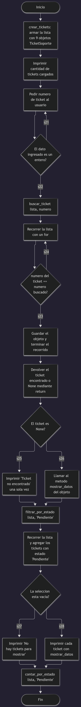
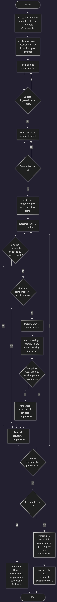

# Trabajo práctico READ

Ejercicios de Python con Programación Orientada a Objetos. Todos trabajan con objetos guardados en memoria y solo hacen operaciones de lectura (READ). No usan base de datos.

## Archivos

El repositorio tiene cinco programas:

- **ejercicio1.py**: mesa de ayuda. Consulta tickets por número y muestra los que están pendientes.
- **ejercicio2.py**: biblioteca multimedia. Busca títulos por una palabra o parte del título, sin distinguir mayúsculas.
- **ejercicio3.py**: laboratorio. Filtra componentes por tipo y por stock mínimo.
- **ejercicio4.py**: catálogo de videojuegos. Consultas por género, por horas estimadas y por código.
- **ejercicio5.py**: servicio técnico. Menú con varias consultas de reparaciones y opción de salir.

Además se incluyen los tres diagramas de flujo pedidos, uno por los ejercicios 1, 3 y 5.

## Diagramas de flujo

Las imágenes se hicieron en draw.io y se guardaron en PNG:

## Qué se practica en cada ejercicio

**Ejercicio 1 (Mesa de ayuda)**
Tickets de soporte con número, usuario, sector, problema, prioridad y estado. Se busca un ticket por número y se cuentan los pendientes.

**Ejercicio 2 (Biblioteca multimedia)**
Recursos digitales con código, título, categoría, autor, año y disponibilidad. La búsqueda por título no distingue mayúsculas y encuentra coincidencias parciales.

**Ejercicio 3 (Laboratorio)**
Componentes con código, nombre, tipo, marca, stock y ubicación. Combina dos condiciones: el tipo pedido y un stock mínimo. Se resuelve en un solo recorrido de la lista.

**Ejercicio 4 (Catálogo de videojuegos)**
Videojuegos con código, título, género, plataforma, año y horas estimadas. Las consultas usan los métodos `es_del_genero()` y `supera_horas()`.

**Ejercicio 5 (Servicio técnico)**
Reparaciones con orden, cliente, equipo, falla, estado, técnico y costo estimado. Menú con cinco consultas distintas y opción de salir.